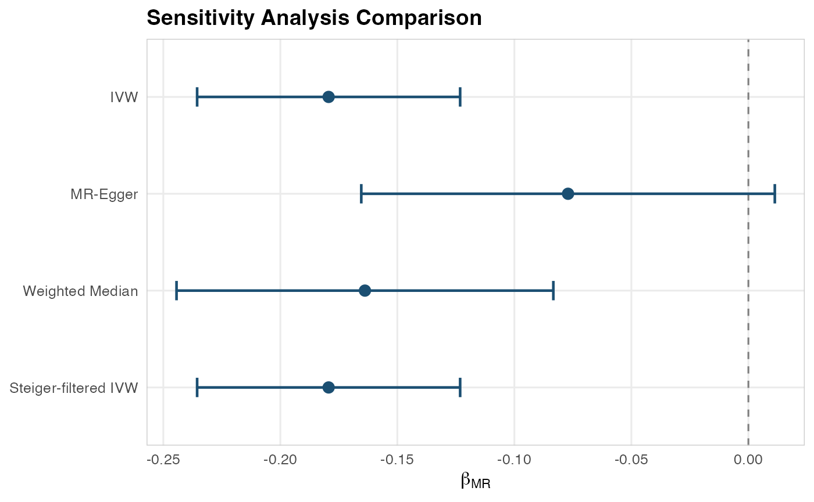

# IL-6 Signaling and Colorectal Cancer: A Complete MR Walkthrough

## Scientific Background

Interleukin-6 (IL-6) is a pleiotropic cytokine involved in inflammation,
immune regulation, and hematopoiesis. Elevated IL-6 levels have been
associated with colorectal cancer risk in observational studies, but
these associations may be confounded by lifestyle factors, adiposity, or
reverse causation (cancer causing inflammation rather than vice versa).

Mendelian Randomization can address this question: **Does genetically
proxied IL-6 signaling causally affect colorectal cancer risk?**

The IL-6 receptor (IL6R) gene region on chromosome 1q21 contains
well-characterized variants (notably rs2228145/Asp358Ala) that alter
IL-6 signaling. These serve as strong genetic instruments for MR
analysis.

## Step 1: Instrument Assembly

In a real analysis, you would query OpenGWAS:

``` r
library(Medusa)

# Query OpenGWAS for IL-6 receptor GWAS
instruments <- getMRInstruments(
  exposureTraitId = "ieu-a-1119",  # IL-6 receptor levels
  pThreshold = 5e-8,
  r2Threshold = 0.001,
  kb = 10000,
  ancestryPopulation = "EUR"
)
```

For this vignette, we create instruments from known IL6R-region SNPs:

``` r
library(Medusa)

instruments <- createInstrumentTable(
  snpId = c("rs2228145", "rs4129267", "rs7529229", "rs4845625",
            "rs6689306", "rs12118721", "rs4453032"),
  effectAllele = c("C", "T", "T", "T", "G", "T", "A"),
  otherAllele = c("A", "C", "C", "C", "A", "C", "G"),
  betaZX = c(0.35, 0.31, 0.28, 0.22, 0.18, 0.15, 0.12),
  seZX = c(0.015, 0.016, 0.017, 0.018, 0.020, 0.022, 0.025),
  pvalZX = c(1e-100, 1e-80, 1e-60, 1e-30, 1e-18, 1e-10, 1e-6),
  eaf = c(0.39, 0.37, 0.35, 0.42, 0.28, 0.31, 0.22),
  geneRegion = rep("IL6R", 7)
)

cat(sprintf("Assembled %d instruments from the IL6R region.\n", nrow(instruments)))
#> Assembled 7 instruments from the IL6R region.
cat(sprintf("F-statistics range: %.0f to %.0f\n",
            min(instruments$fStatistic), max(instruments$fStatistic)))
#> F-statistics range: 23 to 544
```

## Step 2: Outcome Cohort Definition

In OMOP CDM, incident colorectal cancer would typically be defined
using:

- **SNOMED concepts**: Malignant neoplasm of colon (concept ID 4089661),
  Malignant neoplasm of rectum (concept ID 4180790)
- **ICD-10-CM**: C18.x (colon), C19 (rectosigmoid junction), C20
  (rectum)
- **Exclusion criteria**: Prior history of any cancer, inflammatory
  bowel disease
- **Washout period**: \>= 365 days of prior observation

``` r
# This would run at each OMOP CDM site
cohort <- buildMRCohort(
  connectionDetails = connectionDetails,
  cdmDatabaseSchema = "cdm",
  cohortDatabaseSchema = "results",
  cohortTable = "cohort",
  outcomeCohortId = 1234,  # Your colorectal cancer cohort ID
  instrumentTable = instruments,
  genomicLinkageSchema = "genomics",
  genomicLinkageTable = "genotype_data",
  washoutPeriod = 365,
  excludePriorOutcome = TRUE
)
```

## Step 3: Simulated Analysis

For this vignette, we use simulated data to demonstrate the full
pipeline:

``` r
# Simulate data with a modest protective effect (OR ~ 0.85, beta ~ -0.16)
simData <- simulateMRData(
  n = 8000,
  nSnps = 7,
  trueEffect = -0.16,
  seed = 2026
)

# Fit outcome model
profile <- fitOutcomeModel(
  cohortData = simData$data,
  covariateData = NULL,
  instrumentTable = simData$instrumentTable,
  betaGrid = seq(-2, 2, by = 0.02),
  siteId = "site_vignette"
)
#> Fitting outcome model at site 'site_vignette' (3951 cases, 4049 controls)...
#> Site 'site_vignette': beta_ZY_hat = -0.1959 (SE = 0.0934).
```

## Step 4: Federated Pooling

Simulating three sites pooling their results:

``` r
# Simulate profiles from 3 sites
siteProfiles <- simulateSiteProfiles(
  nSites = 3,
  betaGrid = seq(-2, 2, by = 0.02),
  trueBeta = -0.16,
  nPerSite = 5000,
  seed = 2026
)

# Pool
combined <- poolLikelihoodProfiles(siteProfiles)
#> Pooling profile likelihoods from 3 site(s)...
#> Pooling complete: 3 sites, 1670 total cases, 13330 total controls.

# Visualize
plotLikelihoodProfile(
  combinedProfile = combined,
  siteProfileList = siteProfiles,
  title = "Profile Likelihood: IL-6 Signaling on Colorectal Cancer"
)
```


## Step 5: MR Estimate

``` r
estimate <- computeMREstimate(combined, instruments)
#> MR estimate: beta = -0.6280 (95% CI: -1.2560, 0.0000), p = 6.61e-02
#> Odds ratio: 0.534 (95% CI: 0.285, 1.000)

cat(sprintf("Causal OR for IL-6 signaling on colorectal cancer: %.3f\n",
            estimate$oddsRatio))
#> Causal OR for IL-6 signaling on colorectal cancer: 0.534
cat(sprintf("95%% CI: [%.3f, %.3f]\n", estimate$orCiLower, estimate$orCiUpper))
#> 95% CI: [0.285, 1.000]
cat(sprintf("P-value: %.2e\n", estimate$pValue))
#> P-value: 6.61e-02
```

## Step 6: Sensitivity Analyses

``` r
# Create per-SNP estimates (simulated)
set.seed(2026)
nSnps <- 7
betaZX <- instruments$beta_ZX
perSnp <- data.frame(
  snp_id = instruments$snp_id,
  beta_ZY = -0.16 * betaZX + rnorm(nSnps, 0, 0.01),
  se_ZY = runif(nSnps, 0.015, 0.030),
  beta_ZX = betaZX,
  se_ZX = instruments$se_ZX
)

sensitivity <- runSensitivityAnalyses(perSnp)
#> Running sensitivity analyses with 7 SNPs...
#>   IVW...
#>   MR-Egger...
#>   Weighted Median...
#>   Steiger filtering...
#>   Leave-One-Out...
#> Sensitivity analyses complete.

# Summary
print(sensitivity$summary)
#>                 method     beta_MR      se_MR   ci_lower    ci_upper
#> 1                  IVW -0.17936295 0.02866996 -0.2355561 -0.12316983
#> 2             MR-Egger -0.07706141 0.04507740 -0.1654131  0.01129030
#> 3      Weighted Median -0.16385222 0.04107488 -0.2443590 -0.08334546
#> 4 Steiger-filtered IVW -0.17936295 0.02866996 -0.2355561 -0.12316983
#>           pval
#> 1 3.946536e-10
#> 2 1.480457e-01
#> 3 6.632152e-05
#> 4 3.946536e-10

# Forest plot
plotSensitivityForest(sensitivity)
#> `height` was translated to `width`.
```



## Interpretation for Drug Development

The MR analysis provides genetic evidence regarding the causal role of
IL-6 signaling in colorectal cancer risk. Key considerations for
translating MR findings to drug development:

1.  **Direction of effect**: A protective OR \< 1 for genetically
    increased IL-6 signaling would suggest that IL-6 *inhibition* could
    increase cancer risk, relevant for anti-IL-6 drug safety monitoring.

2.  **Sensitivity analysis concordance**: If IVW, MR-Egger, and weighted
    median estimates agree in direction and significance, this
    strengthens the causal interpretation.

3.  **MR-Egger intercept**: A non-significant intercept suggests no
    evidence of directional pleiotropy, supporting the validity of the
    MR assumptions.

4.  **Comparison to clinical trials**: MR estimates represent lifelong
    genetic differences, while drug effects are time-limited. The
    direction should agree, but magnitudes may differ.
