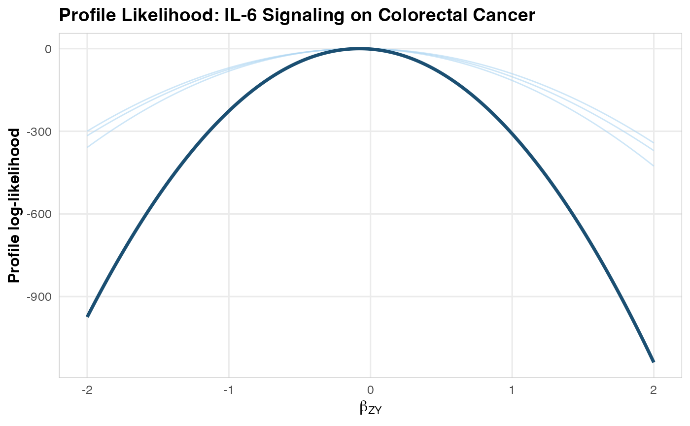

<div id="main" class="col-md-9" role="main">

# IL-6 Signaling and Colorectal Cancer: A Complete MR Walkthrough

<div class="section level2">

## Scientific Background

Interleukin-6 (IL-6) is a pleiotropic cytokine involved in inflammation,
immune regulation, and hematopoiesis. Elevated IL-6 levels have been
associated with colorectal cancer risk in observational studies, but
these associations may be confounded by lifestyle factors, adiposity, or
reverse causation (cancer causing inflammation rather than vice versa).
The IL6R missense variant rs2228145 (Asp358Ala) is a biologically
well-characterized perturbation of the pathway: it increases soluble
IL-6 receptor levels and alters downstream signaling (Ferreira et al.,
2013).

Mendelian Randomization can address this question: **Does genetically
proxied IL-6 signaling causally affect colorectal cancer risk?**

The IL-6 receptor (IL6R) gene region on chromosome 1q21 contains
well-characterized variants (notably rs2228145/Asp358Ala) that alter
IL-6 signaling. These serve as strong genetic instruments for MR
analysis. Recent MR work on circulating interleukins and colorectal
cancer has not established a clear causal signal for IL-6/IL-6 receptor
traits, so this vignette should be read as a realistic workflow example
anchored in a real scientific question, not as a claim that the
synthetic estimate below reproduces a published effect size
(“Circulating interleukins and risk of colorectal cancer: a Mendelian
randomization study”, 2023).

</div>

<div class="section level2">

## Step 1: Instrument Assembly

In a real analysis, you would query OpenGWAS:

<div id="cb1" class="sourceCode">

``` r
library(Medusa)

# Query OpenGWAS for IL-6 receptor GWAS
instruments <- getMRInstruments(
  exposureTraitId = "ieu-a-1119",  # IL-6 receptor levels
  pThreshold = 5e-8,
  r2Threshold = 0.001,
  kb = 10000,
  ancestryPopulation = "EUR"
)
```

</div>

For this vignette, we use real IL6R-region SNP identifiers but fixed,
deterministic summary-statistic values so the document builds offline.
In a real analysis, the exact `beta_ZX` and `se_ZX` values should come
from the external GWAS used to define the score.

<div id="cb2" class="sourceCode">

``` r
library(Medusa)

# These are literature-grounded IL6R variants. The summary-statistic values
# below are illustrative placeholders for a reproducible offline vignette.
instruments <- createInstrumentTable(
  snpId = c("rs2228145", "rs4129267", "rs7529229", "rs4845625",
            "rs6689306", "rs12118721", "rs4453032"),
  effectAllele = c("C", "T", "T", "T", "G", "T", "A"),
  otherAllele = c("A", "C", "C", "C", "A", "C", "G"),
  betaZX = c(0.35, 0.31, 0.28, 0.22, 0.18, 0.15, 0.12),
  seZX = c(0.015, 0.016, 0.017, 0.018, 0.020, 0.022, 0.025),
  pvalZX = c(1e-100, 1e-80, 1e-60, 1e-30, 1e-18, 1e-10, 1e-6),
  eaf = c(0.39, 0.37, 0.35, 0.42, 0.28, 0.31, 0.22),
  geneRegion = rep("IL6R", 7)
)

cat(sprintf("Assembled %d instruments from the IL6R region.\n", nrow(instruments)))
#> Assembled 7 instruments from the IL6R region.
cat(sprintf("F-statistics range: %.0f to %.0f\n",
            min(instruments$fStatistic), max(instruments$fStatistic)))
#> F-statistics range: 23 to 544
```

</div>

</div>

<div class="section level2">

## Step 2: Outcome Cohort Definition

In OMOP CDM, incident colorectal cancer would typically be defined
using:

-   **SNOMED concepts**: Malignant neoplasm of colon (concept ID
    4089661), Malignant neoplasm of rectum (concept ID 4180790)
-   **ICD-10-CM**: C18.x (colon), C19 (rectosigmoid junction), C20
    (rectum)
-   **Exclusion criteria**: Prior history of any cancer, inflammatory
    bowel disease
-   **Washout period**: &gt;= 365 days of prior observation

<div id="cb3" class="sourceCode">

``` r
# This would run at each OMOP CDM site
cohort <- buildMRCohort(
  connectionDetails = connectionDetails,
  cdmDatabaseSchema = "cdm",
  cohortDatabaseSchema = "results",
  cohortTable = "cohort",
  outcomeCohortId = 1234,  # Your colorectal cancer cohort ID
  instrumentTable = instruments,
  genomicLinkageSchema = "genomics",
  genomicLinkageTable = "genotype_data",
  washoutPeriod = 365,
  excludePriorOutcome = TRUE
)
```

</div>

</div>

<div class="section level2">

## Step 3: Simulated Analysis

To keep the vignette fully executable, we simulate a local site dataset
while preserving the same IL6R score definition used in the instrument
table above. This avoids a common MR mistake: fitting the outcome model
with one score and then computing the Wald ratio with a different
denominator.

<div id="cb4" class="sourceCode">

``` r
# Simulate one site using the same allele-score definition that Medusa fits
set.seed(2026)
n <- 8000

snpMatrix <- sapply(instruments$eaf, function(maf) rbinom(n, 2, maf))
colnames(snpMatrix) <- paste0("snp_", gsub("[^a-zA-Z0-9]", "_", instruments$snp_id))

scoreWeights <- instruments$beta_ZX / (instruments$se_ZX^2)
scoreWeights <- scoreWeights / sum(abs(scoreWeights))
scoreBetaZX <- sum(scoreWeights * instruments$beta_ZX)

confounder1 <- rnorm(n)
confounder2 <- rbinom(n, 1, 0.5)

exposure <- scoreBetaZX * as.numeric(snpMatrix %*% scoreWeights) +
  0.3 * confounder1 + 0.3 * confounder2 + rnorm(n)

trueEffect <- -0.16
logOdds <- trueEffect * exposure + 0.3 * confounder1 + 0.3 * confounder2
outcome <- rbinom(n, 1, 1 / (1 + exp(-logOdds)))

cohortData <- data.frame(
  person_id = seq_len(n),
  outcome = outcome,
  snpMatrix,
  confounder_1 = confounder1,
  confounder_2 = confounder2,
  stringsAsFactors = FALSE
)

betaGrid <- seq(-2, 2, by = 0.02)

# Fit the site-specific outcome model
profile <- fitOutcomeModel(
  cohortData = cohortData,
  covariateData = NULL,
  instrumentTable = instruments,
  betaGrid = betaGrid,
  siteId = "site_A"
)
#> Fitting outcome model at site 'site_A' (4226 cases, 3774 controls)...
#> Site 'site_A': beta_ZY_hat = -0.0766 (SE = 0.0749).
```

</div>

</div>

<div class="section level2">

## Step 4: Federated Pooling

To illustrate federated pooling without requiring three live data
partners, we retain the observed `site_A` profile and create two
additional site profiles with the same score definition but slightly
different information content.

<div id="cb5" class="sourceCode">

``` r
makeSyntheticSite <- function(baseProfile, siteId, infoScale, betaShift, caseScale) {
  peak <- baseProfile$betaHat + betaShift
  info <- (1 / (baseProfile$seHat^2)) * infoScale
  logLik <- -0.5 * info * (baseProfile$betaGrid - peak)^2
  logLik <- logLik - max(logLik)

  synthetic <- list(
    siteId = siteId,
    betaGrid = baseProfile$betaGrid,
    logLikProfile = logLik,
    nCases = max(50L, as.integer(round(baseProfile$nCases * caseScale))),
    nControls = max(50L, as.integer(round(baseProfile$nControls * caseScale))),
    snpIds = baseProfile$snpIds,
    diagnosticFlags = baseProfile$diagnosticFlags,
    betaHat = peak,
    seHat = sqrt(1 / info),
    scoreDefinition = baseProfile$scoreDefinition
  )
  class(synthetic) <- "medusaSiteProfile"
  synthetic
}

siteProfiles <- list(
  site_A = profile,
  site_B = makeSyntheticSite(profile, "site_B", infoScale = 0.9,
                             betaShift = 0.01, caseScale = 0.85),
  site_C = makeSyntheticSite(profile, "site_C", infoScale = 1.1,
                             betaShift = -0.01, caseScale = 1.15)
)

# Pool
combined <- poolLikelihoodProfiles(siteProfiles)
#> Pooling profile likelihoods from 3 site(s)...
#> Pooling complete: 3 sites, 12678 total cases, 11322 total controls.

# Visualize
plotLikelihoodProfile(
  combinedProfile = combined,
  siteProfileList = siteProfiles,
  title = "Profile Likelihood: IL-6 Signaling on Colorectal Cancer"
)
```

</div>



</div>

<div class="section level2">

## Step 5: MR Estimate

<div id="cb6" class="sourceCode">

``` r
estimate <- computeMREstimate(combined, instruments)
#> MR estimate: beta = -0.2879 (95% CI: -0.5758, 0.0000), p = 6.47e-02
#> Odds ratio: 0.750 (95% CI: 0.562, 1.000)

cat(sprintf("Causal OR for IL-6 signaling on colorectal cancer: %.3f\n",
            estimate$oddsRatio))
#> Causal OR for IL-6 signaling on colorectal cancer: 0.750
cat(sprintf("95%% CI: [%.3f, %.3f]\n", estimate$orCiLower, estimate$orCiUpper))
#> 95% CI: [0.562, 1.000]
cat(sprintf("P-value: %.2e\n", estimate$pValue))
#> P-value: 6.47e-02
```

</div>

</div>

<div class="section level2">

## Step 6: Sensitivity Analyses

Because the one-shot pooled likelihood is defined on the shared allele
score, pleiotropy-robust summarized-data methods are a secondary
analysis. Here we use per-SNP estimates from the same synthetic site. We
omit Steiger filtering because `runSensitivityAnalyses()` currently does
not implement it for binary outcomes.

<div id="cb7" class="sourceCode">

``` r
# Fit the same site in per-SNP mode for summarized-data sensitivity methods
profilePerSnp <- fitOutcomeModel(
  cohortData = cohortData,
  covariateData = NULL,
  instrumentTable = instruments,
  betaGrid = betaGrid,
  analysisType = "perSNP",
  siteId = "site_A"
)
#> Fitting outcome model at site 'site_A' (4226 cases, 3774 controls)...
#> Site 'site_A': beta_ZY_hat = -0.0766 (SE = 0.0749).

sensitivity <- runSensitivityAnalyses(
  profilePerSnp$perSnpEstimates,
  methods = c("IVW", "MREgger", "WeightedMedian", "LeaveOneOut")
)
#> Running sensitivity analyses with 7 SNPs...
#>   Engine: TwoSampleMR
#> Harmonising exposure (medusa_exposure) and outcome (medusa_outcome)
#>   IVW...
#> Analysing 'medusa_exposure' on 'medusa_outcome'
#>   MR-Egger...
#> Analysing 'medusa_exposure' on 'medusa_outcome'
#>   Weighted Median...
#> Analysing 'medusa_exposure' on 'medusa_outcome'
#>   Leave-One-Out...
#> Sensitivity analyses complete.

# Summary
print(sensitivity$summary)
#>            method     beta_MR      se_MR   ci_lower   ci_upper      pval
#> 1             IVW -0.05796889 0.05178126 -0.1594601 0.04352238 0.2629288
#> 2        MR-Egger -0.05055973 0.16484130 -0.3736487 0.27252922 0.7714205
#> 3 Weighted Median -0.03476007 0.06410561 -0.1604071 0.09088693 0.5876592
```

</div>

</div>

<div class="section level2">

## Interpretation for Drug Development

The MR analysis provides genetic evidence regarding the causal role of
IL-6 signaling in colorectal cancer risk, but the numerical result in
this vignette comes from synthetic outcome data. The worked example is
therefore about correct analysis mechanics, not about claiming a real
protective or harmful effect.

In a real target-validation study, the primary interpretation would rest
on four checks:

1.  **Instrument fidelity**: The same allele score must define the local
    outcome model and the external `beta_ZX` denominator.

2.  **Pleiotropy robustness**: Concordance across IVW, MR-Egger,
    weighted median, and leave-one-out analyses is more informative than
    a single point estimate.

3.  **Clinical triangulation**: Any MR signal should be compared against
    human genetics, disease biology, and trial safety data for IL-6
    pathway blockade.

4.  **Literature context**: The current colorectal-cancer MR literature
    for circulating interleukins remains mixed, so this is best treated
    as a motivating oncology use case rather than a settled causal
    claim.

</div>

<div class="section level2">

## References

-   [Burgess, S., Butterworth, A., & Thompson, S. G. (2013). Mendelian
    randomization analysis with multiple genetic variants using
    summarized data. *Genetic Epidemiology*, 37(7),
    658-665.](https://pmc.ncbi.nlm.nih.gov/articles/PMC4377079/)

-   [Bowden, J., Davey Smith, G., & Burgess, S. (2015). Mendelian
    randomization with invalid instruments: effect estimation and bias
    detection through Egger regression. *International Journal of
    Epidemiology*, 44(2),
    512-525.](https://pubmed.ncbi.nlm.nih.gov/26050253/)

-   [Bowden, J., et al. (2016). Consistent estimation in Mendelian
    randomization with some invalid instruments using a weighted median
    estimator. *Genetic Epidemiology*, 40(4),
    304-314.](https://pmc.ncbi.nlm.nih.gov/articles/PMC4849733/)

-   [Ferreira, R. C., Freitag, D. F., Cutler, A. J., Howson, J. M. M.,
    et al. (2013). Functional IL6R 358Ala allele impairs classical IL-6
    receptor signaling and influences risk of diverse inflammatory
    diseases. *PLoS Genetics*, 9(4),
    e1003444.](https://journals.plos.org/plosgenetics/article?id=10.1371/journal.pgen.1003444)

-   [Circulating interleukins and risk of colorectal cancer: a Mendelian
    randomization study. (2023). *Journal of Cancer Research and
    Clinical Oncology*.
    PMID: 37525405.](https://pubmed.ncbi.nlm.nih.gov/37525405/)

</div>

</div>
